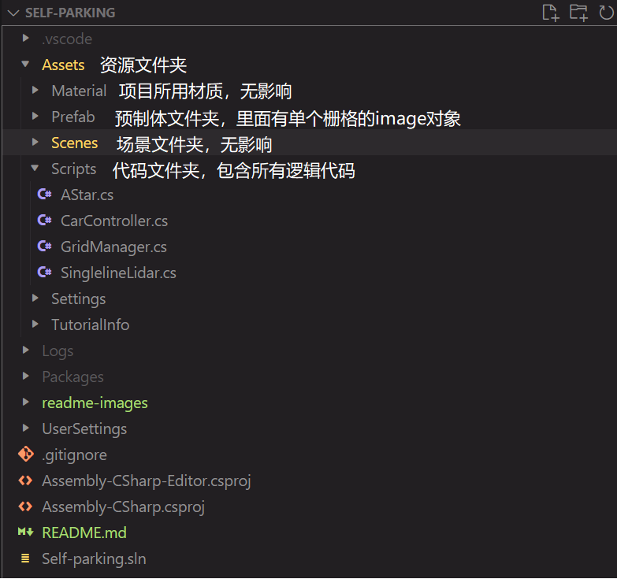
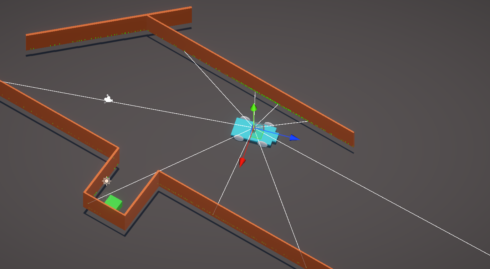
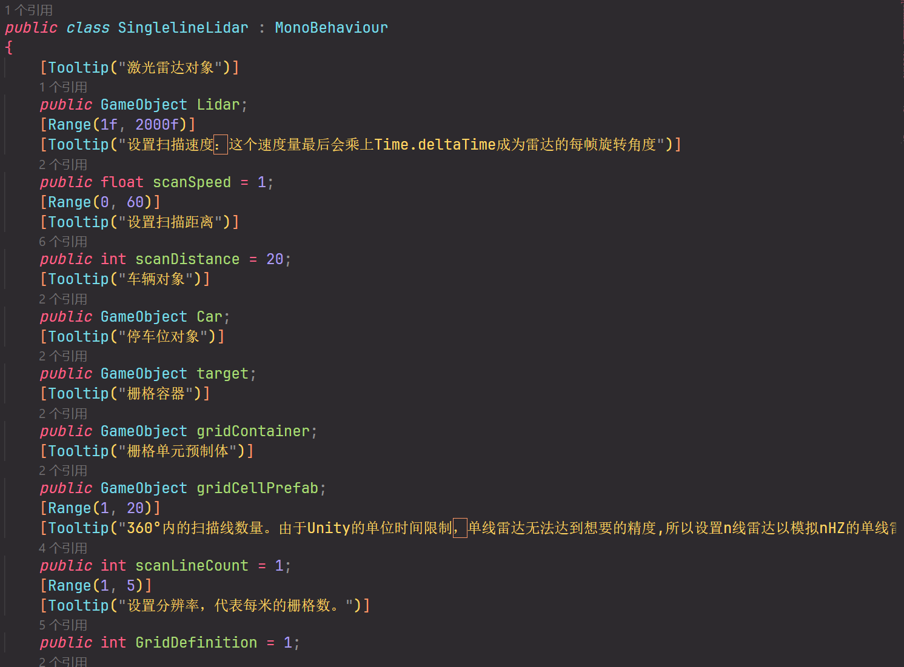
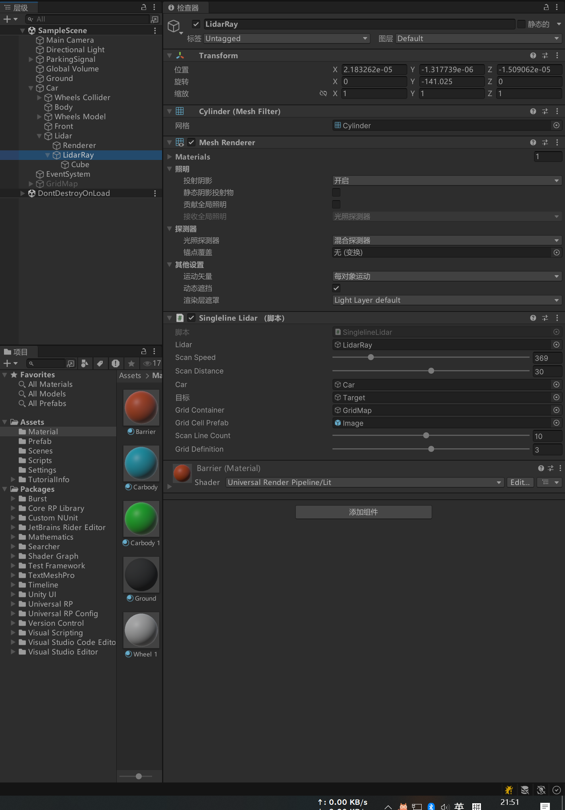
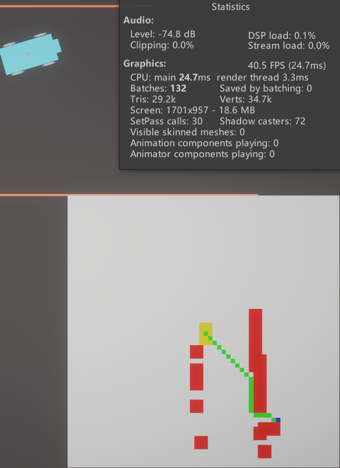
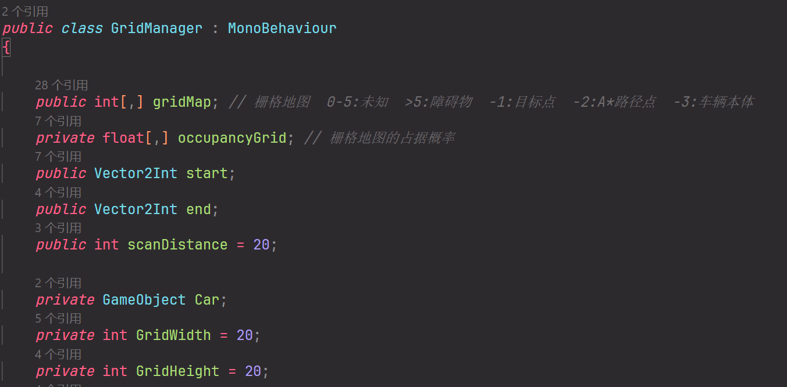

# 人工智能大作业: 基于不确定性推理的自动泊车仿真 
### 利用Unity仿真单线激光雷达和环境，在停车场场景中实现自主泊车 

#### 项目目录
  

#### 环境
代码编辑器: ```VSCode``` + ```Unity插件```

仿真所用版本：```Unity 2022.3.47f1c1``` ，理论上你用其他版本也能跑起来

可以直接运行的打包版本在```/Releases```下
#### 流程
- 使用模拟单线激光雷达与贝叶斯推理进行数据采集与处理 

- 使用2D栅格地图进行环境建模

- 路径规划 - A*

- 运动控制 

#### 核心脚本代码 (```项目目录/Assets/Scripts/*```)
- SinglelineLidar.cs 

  利用unity的raycast功能实现激光雷达仿真，用n线激光雷达代替nHZ的单线雷达来规避帧率的影响
  
  
  
- GridManager.cs
  
  栅格地图管理脚本，维护一个二维数组，存储栅格地图。同时包含绘制的函数
  
  
- AStar.cs
 
  A*算法实现，这个没什么好说的
- CarController.cs
 
  车辆的控制，利用了Unity的WheelCollider做碰撞检测和车轮模拟，通过转向角和马力来控制车辆